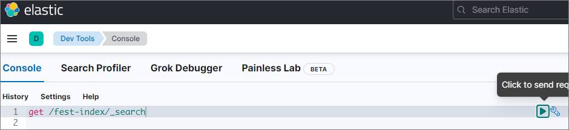
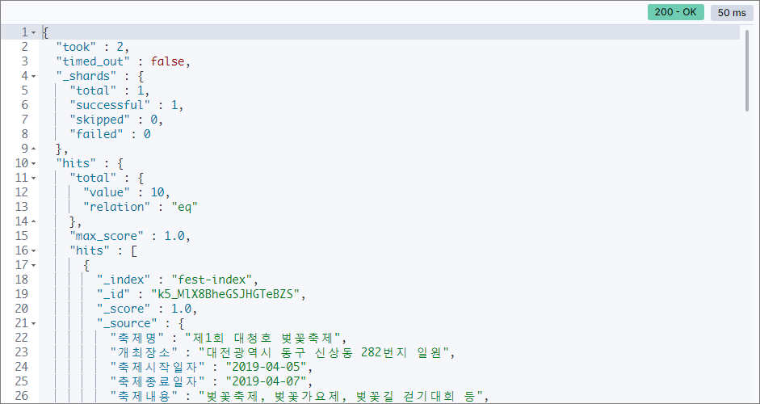
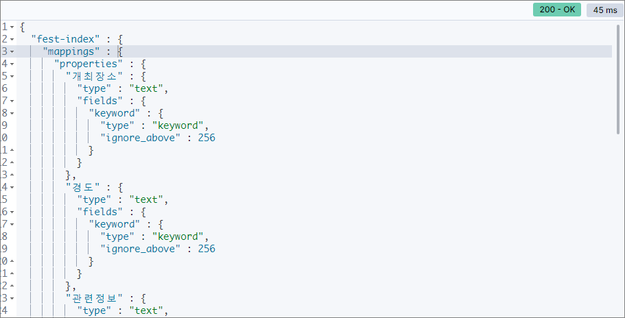

# Elasticsearch, Python (1) - 이용 환경 만들기
 
## 사용 환경
- MS-Windows 10
- CMD Console
- Elasticsearch 8.1.0
- Kibana 8.1.0
- Python 3.10.2

## Elastic Stack 설치
### Elasticsearch, Kibana [Download](https://www.elastic.co/kr/start)  
### 로컬 PC 에서 압축 풀기 
+ Elasticsearch 설치 경로 : `D:\ES\elasticsearch-8.1.0`
+ Kibana 설치 경로 : `D:\ES\kibana-8.1.0`

### Elasticsearch 실행  

```cmd
cd D:\ES\elasticsearch-8.1.0 
bin\elasticsearch.bat
```

**처음 실행 시 기본 계정인 elastic 의 password 와 Kibana 와 연계를 위한 enrollment token 정보 확인 필요**  

```
-> Elasticsearch security features have been automatically configured!
-> Authentication is enabled and cluster connections are encrypted.

->  Password for the elastic user (reset with `bin/elasticsearch-reset-password -u elastic`):
dydfO7opMFZBFI=76GdS

->  HTTP CA certificate SHA-256 fingerprint:
7232afeadcd21cd1193f7f5bbe1d475b12be3de76e44ddb961ec692cf725f94a

->  Configure Kibana to use this cluster:
* Run Kibana and click the configuration link in the terminal when Kibana starts.
* Copy the following enrollment token and paste it into Kibana in your browser (valid for the next 30 minutes):
eyJ2ZXIiOiI4LjEuMCIsImFkciI6WyIxMC4xMDEuMTQ1Ljk0OjkyMDAiXSwiZmdyIjoiNzIzMmFmZWFkY2QyMWNkMTE5M2Y3ZjViYmUxZDQ3NWIxMmJlM2RlNzZlNDRkZGI5NjFlYzY5MmNmNzI1Zjk0YSIsImtleSI6IlhKc3NpMzhCMGpUb2tGTHhydGhJOnktOVo1azFtUzNPWGk2VFpYSGVBa0EifQ==

->  Configure other nodes to join this cluster:
* On this node:
- Create an enrollment token with `bin/elasticsearch-create-enrollment-token -s node`.
- Uncomment the transport.host setting at the end of config/elasticsearch.yml.
- Restart Elasticsearch.
* On other nodes:
- Start Elasticsearch with `bin/elasticsearch --enrollment-token <token>`, using the enrollment token that you generated.
```

Elasticsearch 가 처음 시작되면 `config/certs` 디렉토리가 만들어지고, elasticsearch 접근을 위한 인증서 파일이 생성된다.  
만들어진 `http_ca.crt` 파일은 Python 접속을 위해 사용된다.  
시작 시 Console 에 보이는 내용 중 `HTTP CA certificate SHA-256 fingerprint` 항목의 값은 Python 에서 접속을 위해 사용된다. 

### fingerprint 확인 방법 (Optional)
Windows 10 에는 openssl 이 기본 설치되어 있지 않다. openssl 을 설치하거나, git, mingw 를 설치하면 openssl 이 포함되어 있다.  
아래는 git bash 에서 실행  

```bash
cd d:/es/elasticsearch-8.1.0/config/certs
openssl x509 -noout -fingerprint -sha256 -inform pem -in http_ca.crt
```

':' 표시만 제거하면 elasticsearch 시작 시 보여주는 fingerprint 와 동일하다.

### Elasticsearch 실행 확인
```
curl --cacert d:\es\elasticsearch-8.1.0\config\certs\http_ca.crt -u elastic https://localhost:9200
```

### Kibana 실행
```cmd
cd D:\ES\kibana-8.1.0 
bin\kibana.bat
```

처음 시작되면 아래와 같이 설정을 위한 URL 정보가 나타난다.  

```
i Kibana has not been configured.

Go to http://localhost:5601/?code=704159 to get started.
```   

위 URL 로 접근했을 때 보이는 화면, 여기에 elasticsearch 시작 후 보이는 enrollment token 을 입력하고 'Configure Elastic' 버튼을 클릭한다.  
Token 의 유효기간은 30분이니 주의!!    
  

설정이 진행되고, 로그인 화면이 보여진다. elastic 계정이 기본으로 만들어지며, elasticsearch 시작 시 보이는 패스워드를 이용해 로그인 한다.  
  

elastic 계정으로 로그인 후, 패스워드 변경을 위해서 Management 화면으로 들어간다. (Management 클릭)  
  

Users 메뉴에서 elastic 계정으로 들어가 비밀번호를 변경  

### 사용 계정 만들기
elastic 계정은 관리 작업을 위한 것으로 일반 연동에 사용될 수 없으므로 작업용 계정(pyagent)을 생성  
권한은 상황에 따라 적당한 것으로...     
  


## Kibana 에서 API key 만들기
1. 위의 절차로 만들어진 pyagent 계정으로 로그인  
2. Management - Security - API Keys 메뉴로 접근
3. 우측상단 Create API key 버튼을 눌러 연동에 사용할 정보를 생성  
   다양한 형식의 Key Format 이 주어지므로 필요한 것을 사용하면 된다.
   이어지는 Python 예제에서는 JSON 형식에서 보이는 id, api_key 데이타를 이용한다.    
   **key 는 만들 당시에만 보여지므로 복사를 따로 해두는 것이 좋다.**  
     

### 다양한 Key 포맷   
```
Base64 : Ykp1M2kzOEIwalRva0ZMeEJOaGU6aTF1ekszZWxUVlNwWmhha0ZEOHZudw==
JSON: {"id":"bJu3i38B0jTokFLxBNhe","name":"python_agent","api_key":"i1uzK3elTVSpZhakFD8vnw","encoded":"Ykp1M2kzOEIwalRva0ZMeEJOaGU6aTF1ekszZWxUVlNwWmhha0ZEOHZudw=="}
Beats : bJu3i38B0jTokFLxBNhe:i1uzK3elTVSpZhakFD8vnw
Logstach: bJu3i38B0jTokFLxBNhe:i1uzK3elTVSpZhakFD8vnw
```

## Kibana - Dev tools 를 이용해 샘플 데이타 만들기
메뉴에서 보이는 'Dev tools' 화면으로 이동  
  


### 데이타 입력
좌측 Console 에서 샘플 데이타 작성 후 삼각형 모양 클릭하면 입력   
  

```
PUT test_index/_doc/1
{
    "body":"김치는 맛있어",
    "name":"홍길동"
}
```

우측 창에 입력 상태 확인
비슷한 조건으로 몇 개 더 만든다.
```
PUT test_index/_doc/2
{
    "body":"김치찌개도 맛있어",
    "name":"황진이"
}
```
```
PUT test_index/_doc/3
{
    "body":"김치찌개 먹고싶다.",
    "name":"홍길동"
}
```

### 데이타 조회
```
GET test_index/_search
```


## Python 으로 접근하기

### Python 패키지 설치
필요하면 가상환경을 사용한다. 가상환경 생성은 이번 주제가 아니므로 기술하지 않는다.  

```cmd
pip install elasticsearch==8.1.0
```

### Kibana Dev tools 에서 입력된 데이타를 확인
Kibana 에서 만든 API key 와   
Elasticsearch 처음 시작 시 콘솔에서 보인 fingerprint 항목 또는 만들어진 http_ca.crt 파일을 사용해서 접속 정보를 구성한다.  

```python
from elasticsearch import Elasticsearch

es = Elasticsearch(
        "https://localhost:9200",
        api_key=('bJu3i38B0jTokFLxBNhe','i1uzK3elTVSpZhakFD8vnw'),
        ca_certs=r'D:\ES\elasticsearch-8.1.0\config\certs\http_ca.crt',
    )
    
res = es.get(index="test_index", id=1)
print(res['_source'])
```

또는, 

```python
from elasticsearch import Elasticsearch

# ssl_assert_fingerprint 방식이 되다가 안되는 경우가 발생
es = Elasticsearch(
        "https://localhost:9200",
        api_key=('bJu3i38B0jTokFLxBNhe','i1uzK3elTVSpZhakFD8vnw'),
        ssl_assert_fingerprint=("7232afeadcd21cd1193f7f5bbe1d475b12be3de76e44ddb961ec692cf725f94a"),
    )
    
res = es.get(index="test_index", id=1)
print(res['_source'])
```

#### 출력 
```json
{'body': '김치는 맛있어', 'name': '홍길동'}
```

## Elasticsearch 에 한글 형태소 분석기 nori 설치
elasticsearch-plugin 으로 설치한다.   
Korean (nori) Analysis Plugin [설명서][3]  
The Korean (nori) Analysis plugin integrates Lucene nori analysis module into elasticsearch. It uses the mecab-ko-dic dictionary to perform morphological analysis of Korean texts.

```cmd
cd D:\ES\elasticsearch-8.1.0
bin\elasticsearch-plugin install analysis-nori  
```

### 설치 출력 메세지
```cmd
-> Installing analysis-nori
-> Downloading analysis-nori from elastic
[=================================================] 100%?? 
-> Installed analysis-nori
-> Please restart Elasticsearch to activate any plugins installed
```

---

# Elasticsearch, Python (2) - Bulk 입력

## Dataset 가져오기
- 전국문화축제표준데이터, https://www.data.go.kr/data/15013104/standard.do
- json 형식 파일 다운로드 - `전국문화축제표준데이터.json`
  
## Bulk 개념
- elasticsearch 에서의 bulk는 복수 개의 indexing, delete 등 을 한번의 API call 로 수행하는 것이다.

### Elasticsearch Guide 
- Create index API, https://www.elastic.co/guide/en/elasticsearch/reference/master/indices-create-index.html
- Bulk API, https://www.elastic.co/guide/en/elasticsearch/reference/current/docs-bulk.html

### Python Elasticsearch Client
- Helpers, https://elasticsearch-py.readthedocs.io/en/v8.1.0/helpers.html


## Python 코드 작성
입력되는 데이타의 구조(mapping)는 데이타가 입력되면 자동으로 설정되기는 하지만, 사용자가 원하는 구조로 설정되지 않기에 명시적으로 작성해주는 것이 데이타를 다루는데 좋다.  
아래의 코드에서 mapping 변수가 입력 데이타의 구조를 작성하는 부분인데, 이는 다음에 다루기로 하고 주석 처리를 하여 자동으로 생성되게 한다.  
데이타는 10개만 입력되게 처리  

### es_bulk.py
```python
from elasticsearch import Elasticsearch
from elasticsearch import helpers
import json

es = Elasticsearch( 
        'https://localhost:9200',
        api_key=('-cN1kX8BAaFJSMrVR1f_','Ax84KJycSCG3fXU-VIs_BQ'), 
        ca_certs=r'D:\ES\elasticsearch-8.1.0\config\certs\http_ca.crt',
)

index_name = 'fest-index'
mapping = None

# with open('mapping.json', 'r', encoding='utf-8') as fd:
#     mapping = json.load(fd)

if es.indices.exists(index=index_name):
    print(index_name, "index exists.")
else:
    es.indices.create(
        index=index_name,
        mappings = mapping,
    )
    print(index_name, 'index is created.')

def yield_data():
    with open('전국문화축제표준데이터.json','r', encoding='utf-8') as fd:
        jdat = json.load(fd)['records']
    
    for i in jdat[0:10]:
        yield {
            "_index": index_name,
            "_source": i,
        }

helpers.bulk(es, yield_data())
```

## Kibana - Dev tools 에서 확인
```
get /fest-index/_search
```

### 입력
  

### 출력
  


## Kibana 구동 시 오류 (Optional)
처음 설치해서 실행하면 잘되던 것이 두번째 실행을 하면 Elasticsearch와 연결이 되지 않아 실행되지 않는 경우가 발생할 경우도 있다.  
이 경우 config\kibana.yml 파일을 열어 보면 아래와 같이 IP로 URL 이 작성된 부분이 보인다.  
사용자의 PC가 동적으로 IP를 받아오는 경우라면, 매번 IP가 변경되기 때문에 연결이 되지 않는다.  
내 PC에서만 사용하는 것이라면 이 IP를 localhost 로 변경하면 정상적으로 실행된다.  

```yaml
elasticsearch.hosts: ['https://100.104.0.4:9200']
hosts: ['https://100.104.0.4:9200'], ca_trusted_fingerprint: 42376fbf31e025706536cfc90b7f530f01b0d172b0d57622d050d0fb158677bc}]
```

```yaml
elasticsearch.hosts: ['https://localhost:9200']
hosts: ['https://localhost:9200'], ca_trusted_fingerprint: 42376fbf31e025706536cfc90b7f530f01b0d172b0d57622d050d0fb158677bc}]
```

---

# Elasticsearch, Python (3) - mapping 구성

## 자동설정된 mapping 확인
Kibana, Dev tools 에서 아래의 코드로 확인  
```
get /fest-index/_mapping
```

### 결과 화면
  

---
# References
1. [Elastic Stack and Product Documentation][1]
2. [Elasticsearch Python Client v8.1.0][2]
3. [Korean (nori) Analysis Plugin][3]
4. [장고걸스 튜토리얼 (Django Girls Tutorial), 2019][4]
5. [Django REST framework][5]

[1]: https://www.elastic.co/guide/index.html "Elastic Stack and Product Documentation"
[2]: https://elasticsearch-py.readthedocs.io/en/v8.1.0/ "Elasticsearch Python Client v8.1.0"
[3]: https://www.elastic.co/guide/en/elasticsearch/plugins/current/analysis-nori.html "Korean (nori) Analysis Plugin"
[4]: https://tutorial.djangogirls.org/ko/ "장고걸스 튜토리얼 (Django Girls Tutorial)"
[5]: https://www.django-rest-framework.org/ "django REST framework"