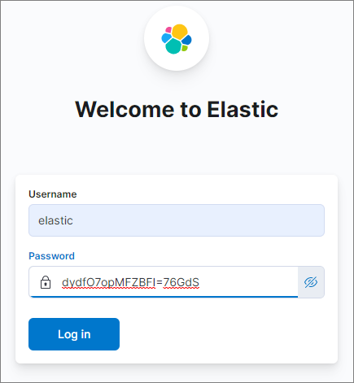

# Elasticsearch, Python 이용 환경 만들기
작성일 : 2022-03-15
 
## 사용 환경
- MS-Windows 10
- CMD Console
- Elasticsearch 8.1.0
- Kibana 8.1.0
- Python 3.10.2

## Elastic Stack 설치
### Elasticsearch, Kibana [Download](https://www.elastic.co/kr/start)  
### 로컬 PC 에서 압축 풀기 
+ Elasticsearch 설치 경로 : `D:\ES\elasticsearch-8.1.0`
+ Kibana 설치 경로 : `D:\ES\kibana-8.1.0`

### Elasticsearch 실행  

```cmd
cd D:\ES\elasticsearch-8.1.0 
bin\elasticsearch.bat
```

**처음 실행 시 기본 계정인 elastic 의 password 와 Kibana 와 연계를 위한 enrollment token 정보 확인 필요**  

```
-> Elasticsearch security features have been automatically configured!
-> Authentication is enabled and cluster connections are encrypted.

->  Password for the elastic user (reset with `bin/elasticsearch-reset-password -u elastic`):
dydfO7opMFZBFI=76GdS

->  HTTP CA certificate SHA-256 fingerprint:
7232afeadcd21cd1193f7f5bbe1d475b12be3de76e44ddb961ec692cf725f94a

->  Configure Kibana to use this cluster:
* Run Kibana and click the configuration link in the terminal when Kibana starts.
* Copy the following enrollment token and paste it into Kibana in your browser (valid for the next 30 minutes):
eyJ2ZXIiOiI4LjEuMCIsImFkciI6WyIxMC4xMDEuMTQ1Ljk0OjkyMDAiXSwiZmdyIjoiNzIzMmFmZWFkY2QyMWNkMTE5M2Y3ZjViYmUxZDQ3NWIxMmJlM2RlNzZlNDRkZGI5NjFlYzY5MmNmNzI1Zjk0YSIsImtleSI6IlhKc3NpMzhCMGpUb2tGTHhydGhJOnktOVo1azFtUzNPWGk2VFpYSGVBa0EifQ==

->  Configure other nodes to join this cluster:
* On this node:
- Create an enrollment token with `bin/elasticsearch-create-enrollment-token -s node`.
- Uncomment the transport.host setting at the end of config/elasticsearch.yml.
- Restart Elasticsearch.
* On other nodes:
- Start Elasticsearch with `bin/elasticsearch --enrollment-token <token>`, using the enrollment token that you generated.
```

Elasticsearch 가 처음 시작되면 `config/certs` 디렉토리가 만들어지고, elasticsearch 접근을 위한 인증서 파일이 생성된다.  
만들어진 `http_ca.crt` 파일은 Python 접속을 위해 사용된다.  
시작 시 Console 에 보이는 내용 중 `HTTP CA certificate SHA-256 fingerprint` 항목의 값은 Python 에서 접속을 위해 사용된다. 


### Kibana 실행
```cmd
cd D:\ES\kibana-8.1.0 
bin\kibana.bat
```

처음 시작되면 아래와 같이 설정을 위한 URL 정보가 나타난다.  

```
i Kibana has not been configured.

Go to http://localhost:5601/?code=704159 to get started.
```   

위 URL 로 접근했을 때 보이는 화면, 여기에 elasticsearch 시작 후 보이는 enrollment token 을 입력하고 'Configure Elastic' 버튼을 클릭한다.  
Token 의 유효기간은 30분이니 주의!!    
  

설정이 진행되고, 로그인 화면이 보여진다. elastic 계정이 기본으로 만들어지며, elasticsearch 시작 시 보이는 패스워드를 이용해 로그인 한다.  
  

elastic 계정으로 로그인 후, 패스워드 변경을 위해서 Management 화면으로 들어간다. (Management 클릭)  
  

Users 메뉴에서 elastic 계정으로 들어가 비밀번호를 변경  

### 사용 계정 만들기
elastic 계정은 관리 작업을 위한 것으로 일반 연동에 사용될 수 없으므로 작업용 계정(pyagent)을 생성  
권한은 상황에 따라 적당한 것으로...     
  


## Kibana 에서 API key 만들기
1. 위의 절차로 만들어진 pyagent 계정으로 로그인  
2. Management - Security - API Keys 메뉴로 접근
3. 우측상단 Create API key 버튼을 눌러 연동에 사용할 정보를 생성  
   다양한 형식의 Key Format 이 주어지므로 필요한 것을 사용하면 된다.
   이어지는 Python 예제에서는 JSON 형식에서 보이는 id, api_key 데이타를 이용한다.    
   **key 는 만들 당시에만 보여지므로 복사를 따로 해두는 것이 좋다.**  
     

### 다양한 Key 포맷   
```
Base64 : Ykp1M2kzOEIwalRva0ZMeEJOaGU6aTF1ekszZWxUVlNwWmhha0ZEOHZudw==
JSON: {"id":"bJu3i38B0jTokFLxBNhe","name":"python_agent","api_key":"i1uzK3elTVSpZhakFD8vnw","encoded":"Ykp1M2kzOEIwalRva0ZMeEJOaGU6aTF1ekszZWxUVlNwWmhha0ZEOHZudw=="}
Beats : bJu3i38B0jTokFLxBNhe:i1uzK3elTVSpZhakFD8vnw
Logstach: bJu3i38B0jTokFLxBNhe:i1uzK3elTVSpZhakFD8vnw
```

## Kibana - Dev tools 를 이용해 샘플 데이타 만들기
메뉴에서 보이는 'Dev tools' 화면으로 이동  
  


### 데이타 입력
좌측 Console 에서 샘플 데이타 작성 후 삼각형 모양 클릭하면 입력   
  

```
PUT test_index/_doc/1
{
    "body":"김치는 맛있어",
    "name":"홍길동"
}
```

우측 창에 입력 상태 확인
비슷한 조건으로 몇 개 더 만든다.
```
PUT test_index/_doc/2
{
    "body":"김치찌개도 맛있어",
    "name":"황진이"
}
```
```
PUT test_index/_doc/3
{
    "body":"김치찌개 먹고싶다.",
    "name":"홍길동"
}
```

### 데이타 조회
```
GET test_index/_search
```


## Python 으로 접근하기

### Python 패키지 설치
필요하면 가상환경을 사용한다. 가상환경 생성은 이번 주제가 아니므로 기술하지 않는다.  

```cmd
pip install elasticsearch==8.1.0
```

### Kibana Dev tools 에서 입력된 데이타를 확인
Kibana 에서 만든 API key 와   
Elasticsearch 처음 시작 시 콘솔에서 보인 fingerprint 항목 또는 만들어진 http_ca.crt 파일을 사용해서 접속 정보를 구성한다.  

```python
from elasticsearch import Elasticsearch

es = Elasticsearch(
        "https://localhost:9200",
        api_key=('bJu3i38B0jTokFLxBNhe','i1uzK3elTVSpZhakFD8vnw'),
        ssl_assert_fingerprint=("7232afeadcd21cd1193f7f5bbe1d475b12be3de76e44ddb961ec692cf725f94a"),
    )
    
res = es.get(index="test_index", id=1)
print(res['_source'])
```

또는, 

```python
from elasticsearch import Elasticsearch

es = Elasticsearch(
        "https://localhost:9200",
        api_key=('bJu3i38B0jTokFLxBNhe','i1uzK3elTVSpZhakFD8vnw'),
        ca_certs=r'D:\ES\elasticsearch-8.1.0\config\certs\http_ca.crt',
    )
    
res = es.get(index="test_index", id=1)
print(res['_source'])
```

#### 출력 
```json
{'body': '김치는 맛있어', 'name': '홍길동'}
```

## Elasticsearch 에 한글 형태소 분석기 nori 설치
elasticsearch-plugin 으로 설치한다.   
Korean (nori) Analysis Plugin [설명서][5]  
The Korean (nori) Analysis plugin integrates Lucene nori analysis module into elasticsearch. It uses the mecab-ko-dic dictionary to perform morphological analysis of Korean texts.

```cmd
cd D:\ES\elasticsearch-8.1.0
bin\elasticsearch-plugin install analysis-nori  
```

### 설치 출력 메세지
```cmd
-> Installing analysis-nori
-> Downloading analysis-nori from elastic
[=================================================] 100%?? 
-> Installed analysis-nori
-> Please restart Elasticsearch to activate any plugins installed
```

---

# Elasticsearch 검색 환경 만들기

## Dataset 가져오기
- https://datasetsearch.research.google.com/ 에서 Dataset 검색 가능   
- 여기서는 [한국학중앙연구원_한국민족문화대백과사전](https://www.data.go.kr/data/3059498/fileData.do) CSV 파일 다운로드하여 사용
  + dictionary_data.csv 파일로 저장

### 컬럼명
컬럼명
항목명, 원어, 이칭, 키워드, 분야, 유형, 시대, 웹사이트 주소

## Bulk 파일 만들기
elasticsearch 에서의 bulk는 복수 개의 indexing, deleting 등 을 한번의 API call 로 수행하는 것이다.


## Python 으로 검색엔진 구축
- 참고 : 
  + https://mixedprograming.tistory.com/11
  + https://blog.nerdfactory.ai/2019/04/29/django-elasticsearch-restframework.html


## 설정

### Python 가상환경
```cmd
python -m venv django
django\Scripts\activate.bat
```

MS-Windows 10 에서는 상황에 따라 `activate.bat` or `activate.ps1` 실행

### python 패키지 설치
django 가상환경에서 아래의 명령으로 패키지 설치  

```cmd
pip install django
pip install djangorestframework
```

### Django 설정
작업 디렉토리에서 프로젝트를 만들고 프로젝트 내부에 별도의 어플리케이션 만들기

```cmd
django-admin.exe startproject server_project
cd server_project
python manage.py startapp search_app
```

### INSTALLED_APPS 설정
INSTALLED_APPS에는 현재 Django 인스턴스에 활성화된 모든 Django 애플리케이션의 이름들이 나열되어 있습니다. 애플리케이션은 다수의 프로젝트에서 사용할 수 있으므로 server_project/settings.py에서 등록을 해야 합니다.  

server_project\server_project\setting.py 파일 내에서 INSTALLED_APPS 에 'rest_framwework', 'search_app' 추가  

```python
# server_project/settings.py

INSTALLED_APPS = [
    'django.contrib.admin',
    'django.contrib.auth',
    'django.contrib.contenttypes',
    'django.contrib.sessions',
    'django.contrib.messages',
    'django.contrib.staticfiles',
    'rest_framework',
    'search_app',
]
```

### 인덱스 설정 및 생성 
> https://www.elastic.co/guide/en/elasticsearch/reference/master/indices-create-index.html

한글 형태소 분석기 nori 를 통해 데이터를 Tokenizing 할 수 있도록 설정  
search_app 디렉토리 아래 setting_bulk.py 파일을 생성해서 구현  

#### mapping 
mapping은 관계형 데이터베이스의 schema와 비슷한 개념으로, Elasticsearch의 인덱스에 들어가는 데이터의 타입을 정의하는 것입니다.  
mapping 설정을 직접 해주지 않아도 Elastic에서 자동으로 mapping이 만들어지지만 사용자의 의도대로 mapping 해줄 것이라는 보장을 받을 수 없습니다.  
mapping이 잘못된다면 후에 Kibana와 연동할 때도 비효율적이기 때문에 Elastic에서는 mapping을 직접 하는 것을 권장합니다.  
각 필드의 타입을 정의하고 위에서 설정해준 분석기 ‘my_analyzer’로 title과 content를 분석할 수 있도록 설정해줍니다.  

```python
# search_app/setting_bulk.py

es.indices.create(
    index='dictionary',
    body={
        "settings": {
            "index": {
                "analysis": {
                    "analyzer": {
                        "my_analyzer": {
                            "type": "custom",
                            "tokenizer": "nori_tokenizer"
                        }
                    }
                }
            }
        },
        "mappings": {
            "properties": {
                "id": {
                    "type": "long"
                },
                "title": {
                    "type": "text",
                    "analyzer": "my_analyzer"
                },
                "keyword": {
                    "type": "text",
                    "analyzer": "my_analyzer"
                },
                "field": {
                    "type": "text",
                    "analyzer": "my_analyzer"
                },
                "type": {
                    "type": "text",
                    "analyzer": "my_analyzer"
                },
            }
        }
    }
)
```

### Dataset 가져오기
- https://datasetsearch.research.google.com/ 에서 Dataset 검색 가능   
- 여기서는 [한국학중앙연구원_한국민족문화대백과사전](https://www.data.go.kr/data/3059498/fileData.do) CSV 파일 다운로드하여 사용


### Bulk 파일 만들기
elasticsearch 에서의 bulk는 데이터를 Post 또는 Put을 하는 행위입니다.  
search_app에 적용할 내용이니 search_app에 setting_bulk.py를 만듭니다.  
setting_bulk.py 파일에서 구성한 mapping 구조대로 입력 데이타를 구성한다.  


```py
# search_app/setting_bulk.py

import json, csv

with open("dictionary_data.json", encoding='utf-8') as json_file:
    json_data = json.loads(json_file.read())

body = ""
for i in json_data:
    body = body + json.dumps({"index": {"_index": "dictionary"}}) + '\n'
    body = body + json.dumps(i, ensure_ascii=False) + '\n'

es.bulk(body)
```

body 변수는 아래와 같은 구조로 구성된다.

```json
{"index": {"_index": "dictionary"}}
{"id": "1", "title": "가계", "keyworld": "", "field": "사회/가족", "type": "개념용어"}
```

### Elasticsearch 실행
명령어로 실행하거나 백그라운드, 서비스 자동 시작 명령어도 있으나 여기에서는 그냥 프로그램 키는 방법으로 진행하겠습니다.  
`D:\bin\elasticsearch-8.0.1\bin\elasticsearch.bat` 실행

### setting_bulk.py 실행
위에서 만든 데이타 bulk 파일 실행한다.  
`python setting_bulk.py`


## References
1. [장고걸스 튜토리얼 (Django Girls Tutorial), 2019][1]
2. [Django REST framework][2]
3. [Elastic Stack and Product Documentation][3]
4. [Elasticsearch Python Client API Documentation][4]
5. [Korean (nori) Analysis Plugin][5]


[1]: https://tutorial.djangogirls.org/ko/ "장고걸스 튜토리얼 (Django Girls Tutorial)"
[2]: https://www.django-rest-framework.org/ "django REST framework"
[3]: https://www.elastic.co/guide/index.html "Elastic Stack and Product Documentation"
[4]: https://elasticsearch-py.readthedocs.io/en/master/api.html "Elasticsearch Python Client API Documentation"
[5]: https://www.elastic.co/guide/en/elasticsearch/plugins/current/analysis-nori.html "Korean (nori) Analysis Plugin"
